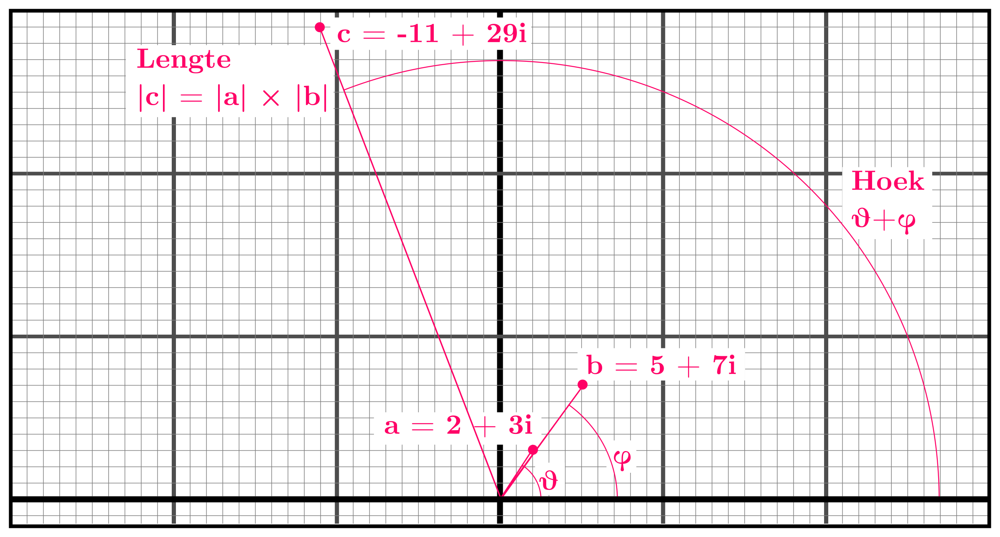

# Julia - Rust Versie

## Casus

Een [fractal](https://en.wikipedia.org/wiki/Fractal) is een afbeelding die zelfgelijkend is. Bekende voorbeelden zijn de [Mandelbrot set](https://en.wikipedia.org/wiki/Mandelbrot_set) en de [Sierpiński triangle](https://en.wikipedia.org/wiki/Sierpi%C5%84ski_triangle). De [Julia set](https://en.wikipedia.org/wiki/Julia_set) is een soort veralgemenisering van de Mandelbrot set, waarbij een startpunt in de 2D ruimte wordt genomen. In dit practicum gaan we onderstaande animatie renderen. Ieder frame is een Julia fractal, waarbij de animatie ontstaat doordat parameters per frame veranderen.


### Complexe getallen (achtergrond)

Om deze 2D-ruimte weer te geven maken we gebruik van de [complexe getallen](https://en.wikipedia.org/wiki/Complex_number) $\mathbb{C}$. Dit is een uitbreiding van de reele $\mathbb{R}$ waar we bekend mee zijn, maar nu gebruiken we twee getallen: het reeele deel dat voor de $x$-as staat, en een imaginair deel voor de $y$-as. Samen vormen de twee getallen een 2D vector waar een paar extra operaties op van toepassing zijn. We schrijven een complex getal doorgaans niet als kolom van getallen in haakjes, maar als $a + bi$, met $a, b \in \mathbb{R}$. $a$ geeft een waarde aan van links naar rechts op de $x$-as, $b$ een waarde van onder naar boven op de $y$-as.

Het belangrijkste verschil tussen complexe getallen en "gewone" 2D-vectoren, is dat we een extra multiplicatie-operatie $\cdot : \mathbb{C} \times \mathbb{C} \to \mathbb{C}$ hebben, die we net als bij gewone vermenigvuldiging meestal niet schrijven ($ab$ is hetzelfde als $a \cdot b$). Met deze operatie vermenigvuldigen we twee complexe getallen, en krijgen we een nieuw complex getal terug. Voor gewone 2D-vectoren bestaat deze operatie niet, en hebben we alleen een inwendig product dat een gewoon (scalair) getal oplevert.

Laten we als voorbeeld kijken naar de getallen $2 + 3i$ en $5 + 7i$. Om deze met elkaar te vermenigvuldigen doen we niet veel anders dan bij het vermenigvuldigen van andere getallen, behalve dat we de waarde $i^2$ het getal $-1$ toekennen. Dit ziet er als volgt uit:

$(2+3i) \cdot (5+7i) = 2 \cdot 5 + 2 \cdot 7i + 3i \cdot 5 + 3i \cdot 7i = 10 + 14i + 15i + 21i^2 = 10 + 14i + 15i + 21\cdot(-1) = 10 + 14i + 15i - 21 = -11 + 29i$



De berekening zie je hierboven ook grafisch uitgebeeld. Als we een complex getal beschouwen als vector en kijken naar de lengte en hoek vanaf de x-as, dan heeft het nieuwe getal de som van de hoeken van de input-getallen, en het product van de lengtes.

### In Rust

In Rust gebruiken we [`num::Complex<f64>`](https://autumnai.github.io/cuticula/num/complex/struct.Complex.html) om complexe getallen op te slaan. Alle rekenkundige operaties zijn dan automatisch beschikbaar:

```rust
let a: num::Complex::<f64> = num::Complex::new(2., 3.);
let b: num::Complex::<f64> = num::Complex::new(5., 7.);
println!("{}", a * b); // -11+29i
```

Voor het plotten van een Julia fractal hebben we constante $c \in \mathbb{C}$ nodig. Wij gebruiken hiervoor het getal $r\cos{a}+ r\sin{a}i$, met $r = 0.7885$ en $a$ afhankelijk van het framenummer. Het huidige framenummer `t` wordt gedeeld door het totale aantal frames per volle rotatie `CYCLE_FRAMES`, en geschaald naar $[0..2\pi)$. Door de sinus en cosinus ontstaat een herhalende beweging van het punt door de 2D ruimte - na `CYCLE_FRAMES` is deze op dezelfde plaats als waar deze begon. De code voor het getal $c$ is hieronder gegeven en staat ook al in de template code. Dit getal is per frame constant.

```rust
let a: f64 = 2 * std::numbers::pi * t / CYCLE_FRAMES;
let r: f64 = 0.7885;
let c: num::Complex::<f64> = num::Complex::new(r * a.cos(), r * a.sin());
```

Het tweede complexe getal wat in onze berekeningen naar boven komt is $z$. Dit getal verschilt per pixel. Effectief beginnen we met een afbeelding gecentreerd rond het punt $(0.75, 0)$, en zoomen we in over tijd. De berekening voor dit getal staat hieronder in C++ code gegeven.

```rust
double x_y_range = 2;

//let scale: f64 = 1.5 - 1.45 * t / FRAMES;                           // iets simpeler
let scale: f64 = 1.5 - 1.45 * (1. + 9. * t as f64 / FRAMES as f64).log(10.);    // iets interessanter om naar te kijken

let mut z: Complex<f64> =
    2. * x_y_range * Complex::new(x as f64 / WIDTH as f64, y as f64 / HEIGHT as f64)
        - Complex::new(x_y_range * 0.75, x_y_range);
z *= scale;
```

#### Toelichting (optioneel)

Uitgaande van het eerste frame (`t == 0`) en een `WIDTH` en `HEIGHT` van $800 \times 600$ komt de pixel $(0, 0)$ overeen met $-2.25 - 3i$, en de pixel $(800, 600)$ met $3.75 + 3i$.
Gedurende de animatie wordt dit ieder frame iets meer geschaald, totdat het laatste frame loopt van $-0.075 - 0.1i$ tot $0.125 + 0.1i$.
De schaalfactor drukken we uit in een losse variabele die we op verschillende manieren kunnen berekenen. Gebruik hiervoor de voorbeeldcode of wordt zelf creatief.

### Algoritme

Voor het plotten van een Julia set kiezen we een escape radius $r$ (deze komt overeen met de `x_y_range` hierboven). Nu gaan we per frame, voor iedere pixel de $z$ steeds de berekening $z := z^2 + c$ uitvoeren. Dit herhalen we totdat $z$ binnen een cirkel met straal $r$ om de oorsprong komt, d.w.z. $\lVert z \rVert < r$. Voor sommige punten zal dit nooit gebeuren, dus stoppen we na een vast aantal iteraties (in de pseudo-code hieronder $81$) en kleuren we de pixel zwart. Voor de punten die voor dat punt binnen de cirkel eindigen, kiezen we een kleur gebaseerd op het aantal iteraties, traditioneel is dit een (deel van de) regenboog, met volle saturatie en helderheid.

In pseudocode ziet dit proces er als volgt uit:

```
escape_radius = 2
max_iter = 81

for each pixel (x, y) do:
    z = scaled pixel # Hierboven uitgelegd

    iteration = 0

    while norm(z) < escape_radius and iteration < max_iter:
        z = z^2 + c
        iteration = iteration + 1

    if iteration == max_iteration:
        pixel(x, y) = black
    else:
        colour_hue = f(iteration / max_iter)       # (0..360)
        pixel(x, y) = HSV(colour_hue, 100%, 100%)
```

Voor het berekenen van de kleur is in het template een inline functie `colourise` beschikbaar die van blauw omgekeerd door het spectrum loopt, gebaseerd op de HSV conversie. Je mag deze as-is gebruiken, aanpassen, of hier zelf een eigen functie voor bedenken.

### Images en Pixels

Voor het schrijven van de frames gebruiken we de [`image`-crate](https://docs.rs/image/0.25.0/image/index.html). Deze heeft een `RgbImage` datatype dat bestaat uit pixels met 3 RGB kanalen, opgeslagen als `u8`.

Voor de video wordt de [`rav1e`-crate](https://docs.rs/rav1e/0.7.1/rav1e/index.html) gebruikt. Deze wordt aan het einde door de root-node gebruikt, is vrij complex, en zit daarom weggewerkt in de eigen `struct Animation`. Deze zorgt ook voor het omzetten van de `RgbImage` naar een flat `Vec<u8>` voor het overzetten via MPI.

De API van `Animation` is als volgt:

- `fn new(job_size: usize) -> Self` - Default constructor, geeft een volledig zwarte frame van `WIDTH`$\times$`HEIGHT` pixels. 
- `fn data(self) -> Vec<u8>` - Zet een frame om in een flat array voor MPI.
- `fn preallocate_root_buffer(total_size) -> Vec<u8>` - Initialiseer een leeg buffer voor de root node.
- `fn reconstruct(data: Vec<u8>) -> Animation` - Reconstrueer een `Animation` van de MPI ontvangen buffer.
- `fn frames(&mut self) -> &mut Vec<RgbImage>` - Verleent mutable access naar de frames `Vec` in de `Animation`.
- `fn len(&self) -> usize` - Lengte in frames van de animatie.
- `fn save(&self, filename: &str)` - Converteer en compress de video met `rav1e` tot een `.av1` bestand. De default compressie is i.v.m. performance minimaal en zonder subsampling, maar kan nog steeds even duren.

## Opdracht

1. We raden voor deze opdracht een ontwerp aan waarbij Rayon gebruikt wordt om de rendering van een frame te parallelliseren, en de frames met MPI over meerdere nodes verdeeld worden. 
   
   - Is dit het beste ontwerp? 
     - Waarom wel (of)
     - wat zou een beter ontwerp zijn (en onderbouw dit)?

2. Maak een ontwerp en voeg MPI toe:
   
   - Alle frames worden in root gegathered
   - Denk na over de werkverdeling over nodes.
     - Makkelijkste optie: homogeen, met collectives en een root node die naderhand alles samenvoegt
     - Uitdagender (ivm handmatig senden van data) met $n-1$ render nodes en een root node die ten alle tijde nieuwe frames verzamelt
       - In hoeverre verwacht je dat dit effect heeft op de snelheid? In hoeverre verwacht je dat dit effect heeft op het geheugengebruik?
   - Denk na over striping vs chunking
     - Wat is de invloed op gathering?
     - Wat is de invloed op performance?
       - Is iedere frame even zwaar om te renderen?

3. Maak een ontwerp en voeg Rayon toe om de rendering binnen een frame te parallelliseren.
   
   - Welke loops kun je wel/niet optimaliseren?

4. Beschrijf in je verslag de gemaakte keuzes en afwegingen. 
   
   - Onderbouw dit met timing-data waarbij je een verschillend aantal nodes / Rayon threads gebruikt voor het renderen van dezelfde animatie.

5. Laat met behulp van afbeeldingen in het verslag het resultaat van je code zien.

6. **Extra:** In de opdrachtbeschrijving en template code gaan we uit van een specifieke Julia set, gebaseerd op een vaste waarde $c$. Voel je vrij deze aan te passen, alsmede de kleuren en de scalingfunctie $(x, y) \to \mathbb{C}$. Het belangrijkste aspect is dat er in het eindresultaat een verandering over tijd is, met een roterend (= herhalend) en schalend/translerend (= niet herhalend) aspect.
